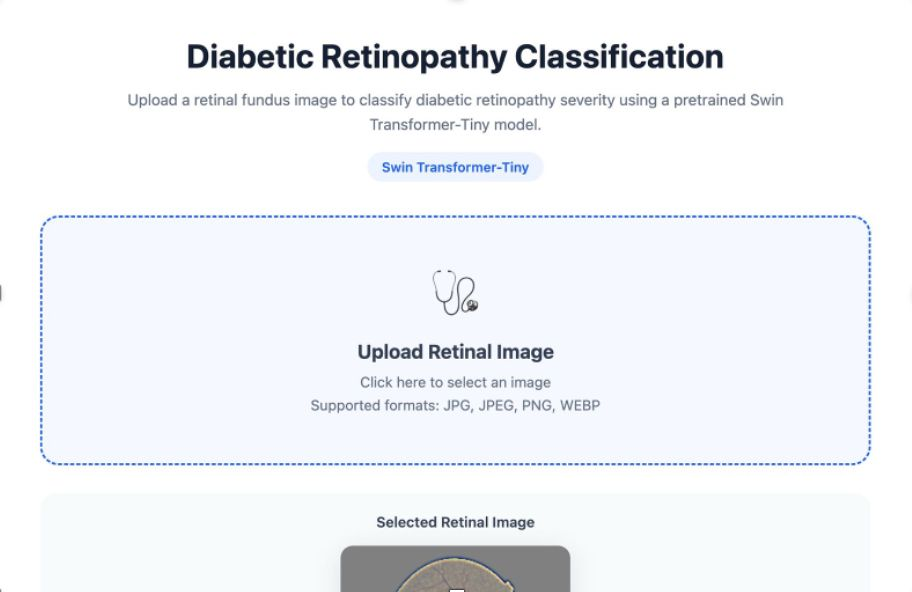
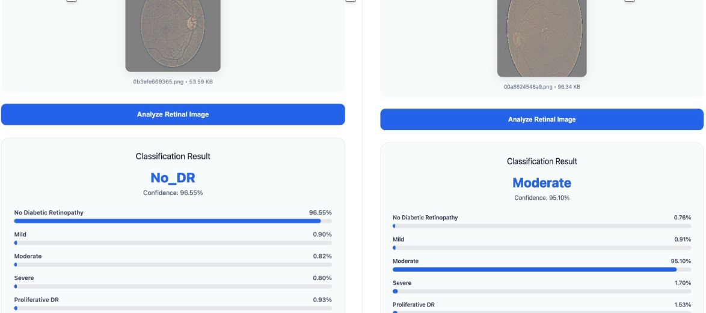
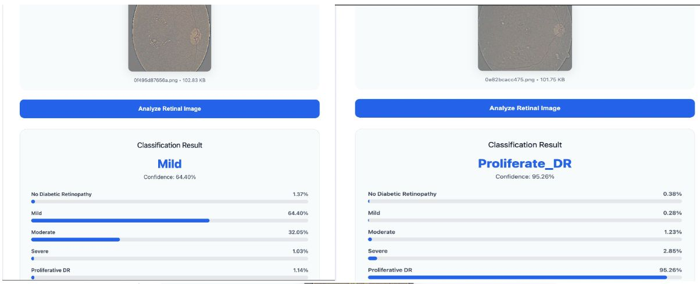
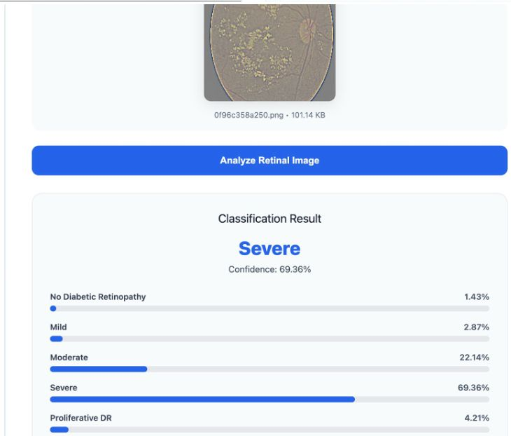

<h1 align="center">Evaluating Vision Transformers for Ordinal Diabetic Retinopathy Classification on Fundus Images</h1>

  A comparative deep learning study benchmarking <b>EfficientNet</b> and <b>Swin Transformer-Tiny</b> for five-class diabetic retinopathy severity classification on retinal fundus images from the <b>APTOS 2019</b> dataset.

  

---

## Table of Contents

1. [Overview](#1-overview)
2. [Dataset](#2-dataset)
3. [Methodology](#3-methodology)
4. [Results](#4-results)
5. [Training Configuration](#5-training-configuration--swin-transformer)
6. [Key Findings](#6-key-findings)
7. [Future Work](#7-future-work)
8. [Technologies](#8-technologies)
9. [Conclusion](#10-conclusion)

---

## 1. Overview

This study investigates deep learning approaches for **five-class diabetic retinopathy (DR) severity classification** from retinal fundus images.

Two transfer-learning architectures were evaluated under a consistent experimental protocol:

| Model | Type | Description |
|---|---|---|
| **TF-EfficientNet** | Convolutional Neural Network | Compound-scaled CNN baseline |
| **Swin Transformer-Tiny** | Vision Transformer | Hierarchical shifted-window self-attention |

**Objective:** determine whether transformer-based visual representation learning provides improved performance over a convolutional baseline for retinal disease severity classification.

  

  

  

---

## 2. Dataset

The project uses the **Diabetic Retinopathy 224×224 (Gaussian Filtered)** dataset, derived from the APTOS 2019 competition.

| Class | Images | Share of Total |
|---|---:|---:|
| No DR | 1,805 | 49.3% |
| Mild | 370 | 10.1% |
| Moderate | 999 | 27.3% |
| Severe | 193 | 5.3% |
| Proliferative DR | 295 | 8.1% |
| **Total** | **3,662** | **100%** |

> The dataset is significantly imbalanced toward the "No DR" class, which motivates the use of balanced and ordinal-aware evaluation metrics (see Section 3).

---

## 3. Methodology

| Step | Description |
|---:|---|
| 1 | Dataset loading and organization |
| 2 | Preprocessing and resizing to 224×224 |
| 3 | ImageNet-statistics normalization |
| 4 | Conservative data augmentation |
| 5 | Stratified train / validation split |
| 6 | Transfer learning with pretrained backbones |
| 7 | Fine-tuning on retinal images |
| 8 | Multi-metric evaluation |

**Evaluation metrics:** Accuracy, Balanced Accuracy, Macro-F1, Quadratic Weighted Kappa (QWK), confusion matrix, and per-class precision / recall / F1. QWK and balanced accuracy are prioritized over raw accuracy given the ordinal, imbalanced nature of the task.

---

## 4. Results

| Metric | TF-EfficientNet | Swin-Tiny |
|---|---:|---:|
| Validation Accuracy | ~84.97% | **79.42%** |
| Macro-F1 | Pending | **53.42%** |
| Balanced Accuracy | Pending | **52.80%** |
| QWK | Pending | **81.02%** |

An earlier Swin-Tiny checkpoint reached **74.9% accuracy** with **QWK = 0.8545**, indicating some run-to-run variance between training runs.

**Finding:** Swin-Tiny outperformed the EfficientNet baseline by approximately **5–7 percentage points** in validation accuracy, suggesting hierarchical self-attention captures more effective retinal feature representations than the evaluated EfficientNet configuration.

---

## 5. Training Configuration — Swin Transformer

| Parameter | Value |
|---|---|
| Architecture | `swin_tiny_patch4_window7_224` |
| Pretraining | ImageNet |
| Input resolution | 224 × 224 |
| Classes | 5 |
| Optimizer | AdamW |
| Backbone learning rate | 2e-5 |
| Head learning rate | 2e-4 |
| Weight decay | 1e-4 |
| Loss | Cross-entropy, label smoothing = 0.05 |
| Scheduler | ReduceLROnPlateau |
| Precision | AMP (mixed) |
| Early stopping | Enabled |

---

## 6. Key Findings

| # | Finding |
|---:|---|
| 1 | Swin-Tiny outperformed the EfficientNet baseline (≈77.22% vs. ~70% accuracy). |
| 2 | QWK is the most clinically meaningful metric here, since DR grades are ordinal. |
| 3 | Accuracy alone overstates performance given class imbalance; Macro-F1 and balanced accuracy (≈53%) indicate substantial headroom on minority classes. |
| 4 | Mild, Severe, and Proliferative DR remain the hardest classes to classify correctly and should be the focus of subsequent work. |

---

## 7. Future Work

| Area | Planned Improvement |
|---|---|
| Preprocessing | Circle-cropping and Ben Graham–style local color normalization to reduce illumination variance across cameras and clinics |
| Resolution | Evaluate 380–512px inputs, since fine lesions (microaneurysms, small hemorrhages) can be lost at 224×224 |
| Evaluation | Independent, held-out test-set evaluation to confirm generalization before publication claims |
| Robustness | Ensembling — combine EfficientNet and Swin-Tiny predictions (or multiple folds/seeds of each) |
| Calibration | Threshold / decision-boundary optimization tuned directly against QWK rather than default argmax |
| Architectures | Benchmark ConvNeXt and larger EfficientNet/Swin variants under an identical protocol |
| Explainability | Grad-CAM or attention-map visualization to verify predictions align with clinically relevant retinal regions |
| Generalization | External validation on an independent DR dataset (e.g., 2015 Kaggle DR dataset or EyePACS) |

---

## 8. Technologies

| Category | Tools |
|---|---|
| Language | Python |
| Deep Learning | PyTorch, `timm`, TorchVision |
| Data Handling | NumPy, Pandas |
| Evaluation | scikit-learn |
| Visualization | Matplotlib |
| Environment | Jupyter, Kaggle GPU |

---

## 10. Conclusion

Swin Transformer-Tiny outperformed the TF-EfficientNet baseline (**84.97% vs. ~79.42%** validation accuracy) on five-class DR classification, indicating that hierarchical transformer representations are a promising direction for retinal image analysis. However, the comparatively low Macro-F1 and balanced accuracy confirm that **minority-class recognition remains the primary bottleneck**. The future-work items above — particularly class-imbalance handling, cross-validation, and independent test-set evaluation — should be addressed before drawing final conclusions.

---

<i>Contributions, issues, and pull requests are welcome.</i>

